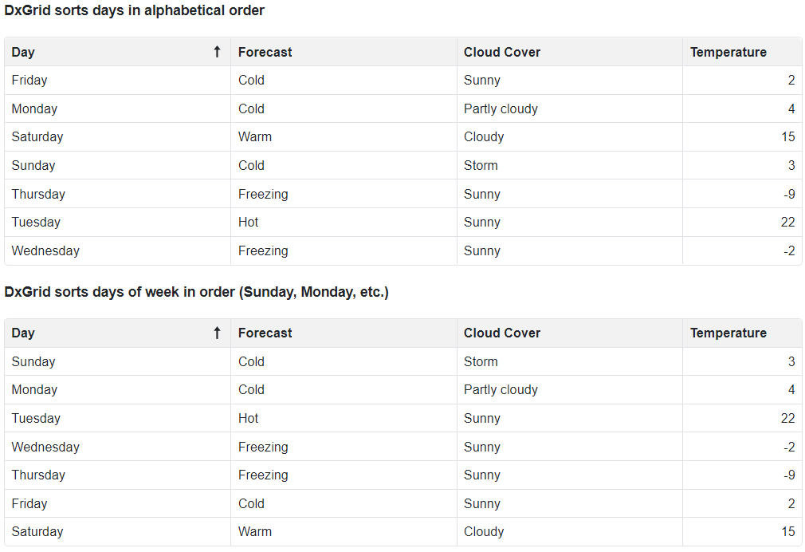

<!-- default badges list -->

<!-- default badges end -->

# Blazor Grid – Custom Sorting
 

The DevExpress Blazor [Grid](https://docs.devexpress.com/Blazor/403143/grid) allows you to introduce custom sort logic within your next DevExpress-powered Blazor web app. This example uses two grids to display weather forecasts for a week. The first grid sorts **Day** column values by value: days are displayed in alphabetical order. The second grid uses the grid’s `Custom` sort mode: days are listed in order (Sunday, Monday, etc.).

<!-- default file list -->
## Files to Review

[Index.razor](./GridCustomSorting/GridCustomSorting/Pages/Index.razor)
<!-- default file list end -->
## Documentation 

[Grid - Sort Modes](https://docs.devexpress.com/Blazor/DevExpress.Blazor.DxGridDataColumn.SortMode)

[Grid - Custom Sorting](https://docs.devexpress.com/Blazor/DevExpress.Blazor.DxGridDataColumn.SortMode#custom-sorting)
